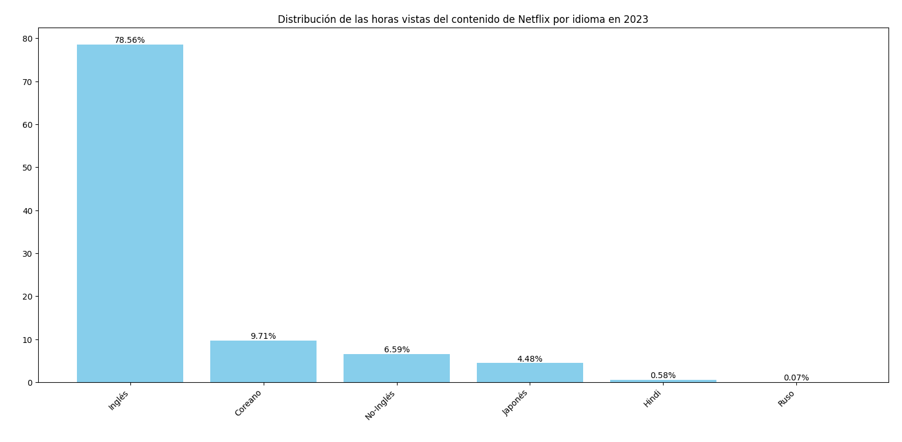
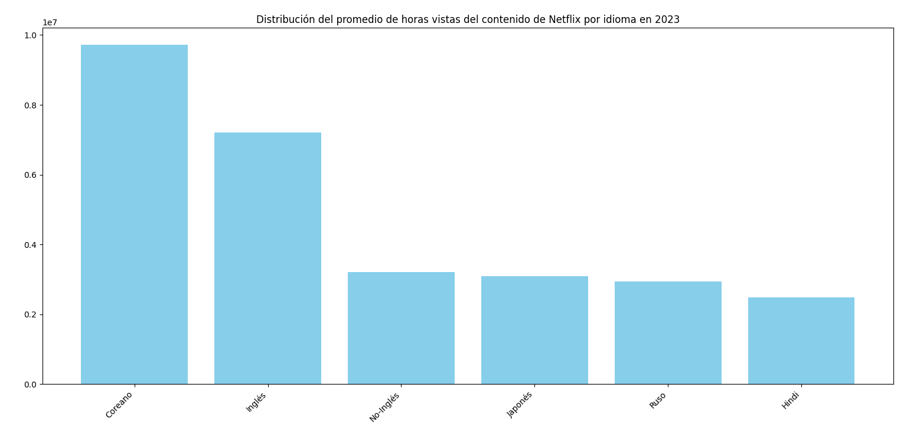
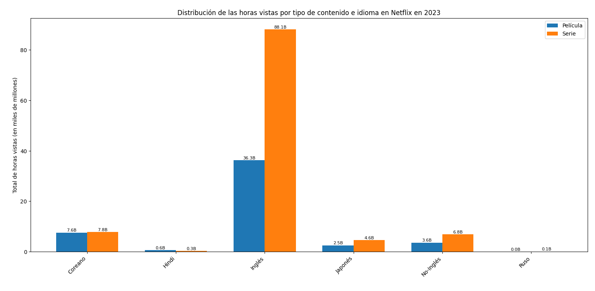
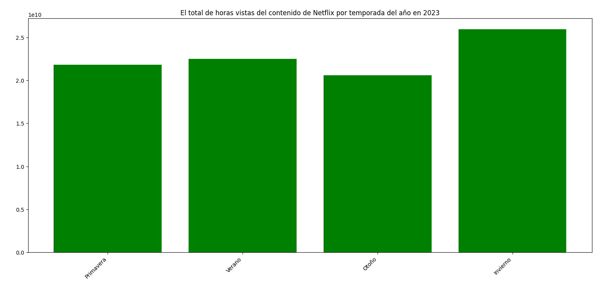
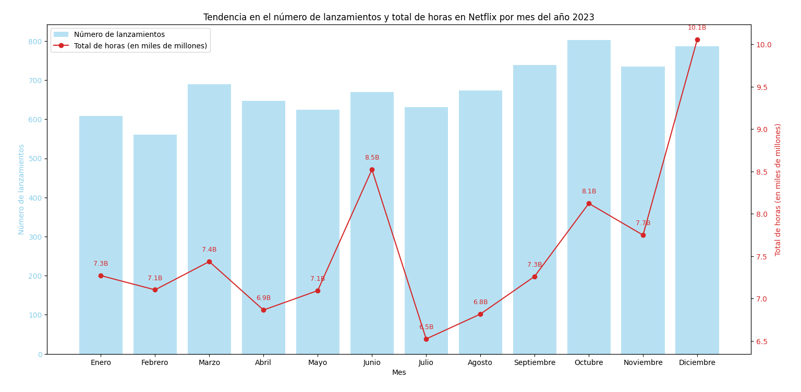
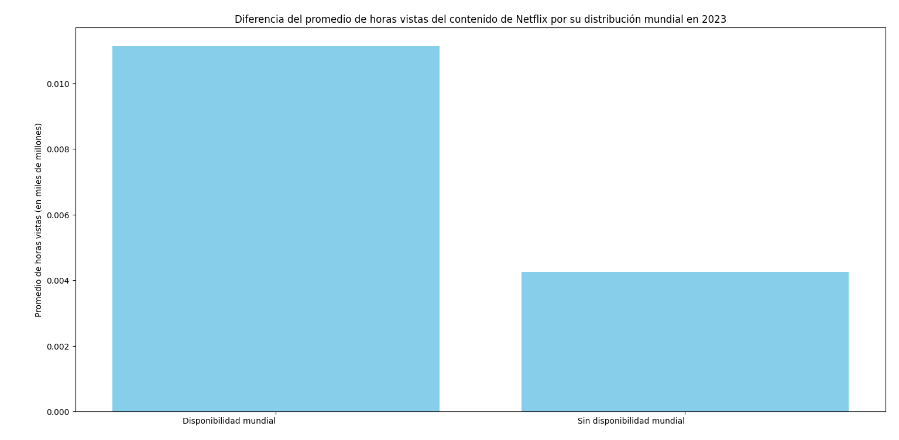
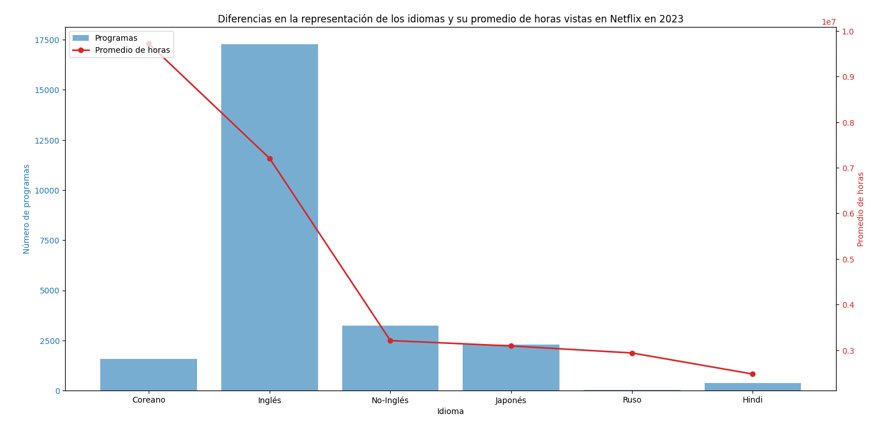
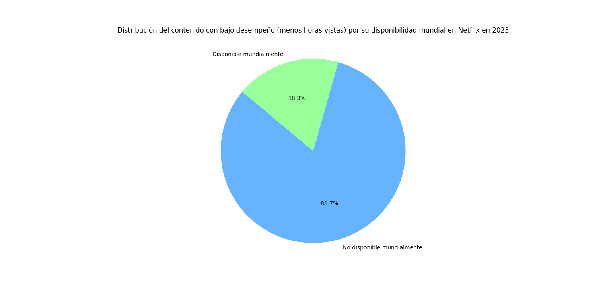

# Introducción

¡Sean bienvenidos a un interesante recorrido por una de las plataformas más exitosas de entretenimiento en streaming en la actualidad! Aquí descubriremos las preferencias que tienen los usuarios de Netflix sobre su contenido en 2023. Tendencias acerca del tipo de contenido, el idioma o fechas de lanzamiento de los programas más exitosos en ese año.

¿Consultas SQL? Encuéntralas aquí: [Análisis_Netflix](Analisis)

# Antecedentes

Este proyecto se origina por el interés de conocer el comportamiento de los usuarios de Netflix en 2023, además de desarrollar y practicar mis habilidades en SQL. Mi labor como analista de datos es utilizar mis conocimientos en la recolección y observación de los datos. Para después realizar el análisis de las horas vistas y número de lanzamientos que hay en los programas de Netflix. Para después mostrar la información con gráficos y tablas y así presentar los insights resultantes.

Los datos recopilados para este análisis provienen de una página de internet llamada [STATSO] (https://statso.io/netflix-content-strategy-case-study/) que se enfoca al análisis de datos y ciencia de datos y comparten casos de estudio para practicar. 

Las preguntas que quería responder a través de mis consultas en SQL fueron:
- ¿Cuál es el tipo de contenido con mayor cantidad de horas vistas en valor absoluto y porcentaje en 2023?
- ¿Cuál es el idioma con más horas vistas en valor absoluto y porcentaje en 2023?
- ¿Es igual la distribución en el promedio que el total de horas vistas por idioma?
- ¿Cuál es la combinación entre el tipo de contenido y el idioma que más horas vistas tiene?
- ¿Cuáles son los 10 programas que los usuarios de Netflix prefirieron en 2023?
- ¿En qué mes del año se estrenaron los programas más populares en 2023?
- ¿En qué temporada del año se lanzaron los programas más populares en 2023?
- ¿Hay una similitud en la tendencia entre el número de lanzamientos y las horas vistas por mes en 2023?
- ¿Hay una similitud en la tendencia entre el número de lanzamientos y las horas vistas por día de la semana en 2023?
- ¿Un programa es más visto por estar disponible mundialmente?
- ¿Que combinación de idioma, tipo de contenido y disponibilidad mundial tiene mayor cantidad de horas vistas en 2023?
- ¿Existen idiomas con baja representación pero alto promedio de horas vistas en 2023?
- ¿Qué porcentaje del contenido con bajo desempeño (menos horas vistas) está disponible mundialmente?
- ¿Qué combinación de idioma y tipo de contenido debería priorizarse para aumentar el engagement?

# Herramientas que utilicé

Para realizar el análisis, aproveché el poder de varias herramientas clave:

**Excel:**: Necesaria para la limpieza de los datos.

**SQL:** La columna vertebral de mi análisis, me permitió consultar la base de datos y descubrir ideas críticas.

**PostgreSQL:** El sistema de gestión de bases de datos elegido, ideal para manejar los datos de las horas vistas realizadas.

**Visual Studio Code:** Mi herramienta principal para la gestión de bases de datos y la ejecución de consultas SQL.

**Python y Matplotlib:**: Útiles para la creación de visualizaciones que representen las consultas y los resultados obtenidos.

**Git y GitHub:** Esenciales para el control de versiones y compartir mis scripts y análisis SQL, asegurando la colaboración y el seguimiento del proyecto.

# El Análisis

El objetivo de cada consulta es analizar la estrategia de contenido de Netflix para comprender cómo varios factores como el tipo de contenido, el idioma, la temporada de lanzamiento y el momento afectan los patrones de audiencia. Al identificar el contenido con mejor rendimiento y el momento de su lanzamiento, el objetivo es descubrir información sobre cómo Netflix maximiza la participación de la audiencia durante todo el año 2023.

## 1. El total de horas vistas por tipo de contenido 

Comenzamos a identificar las diferencias que hay entre los dos tipos de contenido en Netflix: las Series y las Películas, de acuerdo a la cantidad de horas que fueron vistas en el año 2023.La consulta sumó la columna con el número de horas vistas de cada título en la Base de datos y se agrupó en el tipo de contenido. Después, con la función OVER se creó una ventana que contenía las horas vistas de toda la tabla para así obtener el porcentaje del total.

```sql
SELECT
tipo_de_contenido,
SUM(horas_vistas) AS total_horas_vistas,
ROUND(SUM(horas_vistas) * 100 / SUM(SUM(horas_vistas)) OVER(), 2) AS pct_total
FROM netflix_content_2023
GROUP BY 1
ORDER BY 3 DESC;
```

Aquí tienes el desglose de las horas vistas por tipo de contenido en 2023:

- Las **Series** en Netflix tuvieron una mayor preferencia en 2023, con un total de 107,764,100,000 horas que representa el 68.03% del tiempo registrado.

- A comparación de las **Películas** que tuvieron un total de 50,637,800,000 horas vistas, representando el 31.97%.


*Gráfico de pastel que visualiza el porcentaje de horas totales por tipo de contenido; el gráfico se generó con Matplotlib a partir de los resultados de mi consulta SQL.*

## 2. El total de horas vistas por idioma en Netflix

El siguiente punto de interés fue conocer qué idioma resultó ser el más popular entre los usuarios en 2023. Se sumó las horas de cada título y se agrupó en cada idioma. Lo siguiente fue dividir cada uno entre el total de horas vistas (que se obtuvo a través de una subconsulta) para devolver el porcentaje.

```sql
SELECT
idioma,
sum(horas_vistas) as total_de_horas,
ROUND((sum(horas_vistas) * 1.0 / (SELECT SUM(horas_vistas) * 1.0 FROM netflix_content_2023)) * 100,2) AS pct_de_horas
FROM netflix_content_2023
GROUP BY 1
ORDER BY 2 DESC;
```

Aquí tienes el desglose de la distribución de horas por idioma en Netflix en 2023: 

- El **Inglés** fue el idioma más consumido en Netflix en 2023 con un 78.56%, esto significa que más de 3/4 partes del contenido visto fue en esta lengua. En segundo lugar está el idioma **Coreano** con un 9.71% y en tercer lugar la categoría de **No inglés** con 6.59%. Los idiomas menos vistos fueron el **Indú** y el **Ruso**.



*Gráfico de barras que visualiza la distribución de las horas vistas por idioma en Netflix en 2023; el gráfico se generó con Matplotlib a partir de los resultados de mi consulta SQL.*

## 3. Las distribución del promedio de horas vistas por idioma

La siguiente consulta busca saber si la distribución del promedio de horas vistas por idioma es similar al total. Se obtuvo el promedio de horas vistas y se agrupó por idioma.

```sql
SELECT 
  idioma, 
  ROUND(AVG(horas_vistas),2) AS Promedio_Horas_Vistas
FROM netflix_content_2023
GROUP BY 1
ORDER BY 2 DESC;
```
Aquí tienes el desglose del promedio de horas vistas por idioma en Netflix en 2023: 

- No existe una distribución igual en el promedio y el total de horas. La diferencia principal es que el total de horas el **Inglés** fue el primer lugar, pero el Coreano tiene un mayor promedio de horas vistas durante 2023. Lo que indica que el contenido en **Coreano** tiene una mayor tasa de consumo por usuario o por título.



*Gráficos de barras que visualiza el promedio de horas vistas por idioma en Netflix en 2023; los gráficos se generaron con Matplotlib a partir de los resultados de mi consulta SQL.*

## 4. La combinación entre tipo de contenido e idioma con mayor visualización

Conocer cuál fue la combinación entre tipo de contenido e idioma que fue más preferida por los usuarios en Netflix en 2023. La consulta consistió en sumar las horas vistas y agruparlas por tipo de contenido e idioma.

```sql
SELECT
tipo_de_contenido,
idioma,
SUM(horas_vistas) AS total_de_horas
FROM netflix_content_2023
GROUP BY 1,2
ORDER BY 3 DESC;
```
Aquí tienes un desglose de la combinación entre tipo de contenido e idioma que obtuvo la mayor cantidad de vistas en Netflix en 2023:

- Los consumidores en 2023 prefirieron las **Series en Inglés** con un total de 88,140,800,000 horas, seguidas por **Películas en Inglés** con 36,300,900,000 horas, en tercer lugar se encuentran las *Series en idioma Coreano* con 7,792,600,000 horas. La combinación más preferida por los usuarios de Netflix en 2023 fueron las **Series en Inglés**.



*Gráficos de barras que visualiza el total de horas vistas por tipo de contenido e idioma en Netflix en 2023; los gráficos se generaron con Matplotlib a partir de los resultados de mi consulta SQL.*

## 5. Top 10 programas más vistos

Explorar cuáles fueron los 10 programas más vistos en Netflix en 2023. Se organizaron todos los títulos de Netflix del más visto al menos visto y se eligieron los 10 primeros.

```sql
SELECT
titulo,
horas_vistas
FROM netflix_content_2023
ORDER BY 2 DESC
LIMIT 10;
```
|Título|Horas vistas|
|-|-|
|The Night Agent: Season 1|812,100,000|
|Ginny & Georgia: Season 2|665,100,000|
|King the Land: Limited Series // 킹더랜드: 리미티드 시리즈|630,200,000|
|The Glory: Season 1 // 더 글로리: 시즌 1|622,800,000|
|ONE PIECE: Season 1|541,900,000|
|Wednesday: Season 1|507,700,000|
|Queen Charlotte: A Bridgerton Story|503,000,000|
|You: Season 4|440,600,000|
|La Reina del Sur: Season 3|429,600,000|
|Outer Banks: Season 3|402,500,000|

*Tabla con los 10 títulos más populares en Netflix en 2023*

Al analizar los títulos más populares de la plataforma podemos identificar lo siguiente:

- En el Top 10 de títulos más consumidos en Netflix en 2023 podemos observar que las **Series** (presentes en 8 lugares) y el **Inglés** (presentes en 7) tienen una mayor presencia que los demás idiomas y tipo de contenido.

## 6. Mes de lanzamiento de los programas más populares en 2023.

La consulta mostró en qué mes del año se estrenaron en Netflix los programas más populares de 2023. Primero, se extrajo el mes de la fecha de lanzamiento y con la función CASE se nombró cada mes, al final se sumaron las horas vistas y se agruparon.

```sql
SELECT
EXTRACT(MONTH FROM fecha_de_lanzamiento) AS mes,
CASE WHEN EXTRACT(MONTH FROM fecha_de_lanzamiento) = 1 THEN 'Enero' 
    WHEN EXTRACT(MONTH FROM fecha_de_lanzamiento) = 2 THEN 'Febrero'
    WHEN EXTRACT(MONTH FROM fecha_de_lanzamiento) = 3 THEN 'Marzo'
    WHEN EXTRACT(MONTH FROM fecha_de_lanzamiento) = 4 THEN 'Abril'
    WHEN EXTRACT(MONTH FROM fecha_de_lanzamiento) = 5 THEN 'Mayo'
    WHEN EXTRACT(MONTH FROM fecha_de_lanzamiento) = 6 THEN 'Junio'
    WHEN EXTRACT(MONTH FROM fecha_de_lanzamiento) = 7 THEN 'Julio'
    WHEN EXTRACT(MONTH FROM fecha_de_lanzamiento) = 8 THEN 'Agosto'
    WHEN EXTRACT(MONTH FROM fecha_de_lanzamiento) = 9 THEN 'Septiembre'
    WHEN EXTRACT(MONTH FROM fecha_de_lanzamiento) = 10 THEN 'Octubre'
    WHEN EXTRACT(MONTH FROM fecha_de_lanzamiento) = 11 THEN 'Noviembre'
    WHEN EXTRACT(MONTH FROM fecha_de_lanzamiento) = 12 THEN 'Diciembre'
END AS mes_nombre,
SUM(horas_vistas) AS horas_de_visualización
FROM netflix_content_2023
WHERE EXTRACT(MONTH FROM fecha_de_lanzamiento) IS NOT NULL
GROUP BY 1
ORDER BY 1;
```

Aquí tienes el desglose de los meses con títulos más populares en 2023:

- En el mes de **Junio**, **Octubre** y **Diciembre** de lanzaron los títulos más consumidos en 2023. Mientras que en **Abril**, **Julio** y **Agosto** los de menor popularidad. La relación entre los meses y la popularidad se debe a fechas especiales en cada mes **Junio (vacaciones de verano)**, **Octubre (Halloween)** y **Diciembre (Navidad)**, ya que esas son fechas elegidas para estrenar las producciones más esperadas o por los títulos que tienen que ver con alguna fecha especial.


*Gráfico lineal que representa el total de horas vistas por mes de lanzamiento; el gráfico se generó con Matplotlib a partir de los resultados de mi consulta SQL.*

## 7. Temporada del año con los títulos más exitosos en 2023

En la siguiente consulta se agruparon los meses de la fecha de lanzamiento con CASE para obtener las temporadas del año y se sumaron las horas vistas. 

```sql
SELECT
CASE WHEN EXTRACT(MONTH FROM fecha_de_lanzamiento) IN (1,2,3) THEN 1 
    WHEN EXTRACT(MONTH FROM fecha_de_lanzamiento) IN (4,5,6) THEN 2
    WHEN EXTRACT(MONTH FROM fecha_de_lanzamiento) IN (7,8,9) THEN 3
    WHEN EXTRACT(MONTH FROM fecha_de_lanzamiento) IN (10,11,12) THEN 4
END AS numero,
CASE WHEN EXTRACT(MONTH FROM fecha_de_lanzamiento) IN (1,2,3) THEN 'Primavera' 
    WHEN EXTRACT(MONTH FROM fecha_de_lanzamiento) IN (4,5,6) THEN 'Verano'
    WHEN EXTRACT(MONTH FROM fecha_de_lanzamiento) IN (7,8,9) THEN 'Otoño'
    WHEN EXTRACT(MONTH FROM fecha_de_lanzamiento) IN (10,11,12) THEN 'Invierno'
END AS temporada,
SUM(horas_vistas) AS total_horas
FROM netflix_content_2023
WHERE EXTRACT(MONTH FROM fecha_de_lanzamiento) IS NOT NULL
GROUP BY 1,2
ORDER BY 1;
```

Aquí tienes el desglose de las horas vistas por temporada del año en 2023:

- La temporada con lanzamiento más exitosos en 2023 fueron en **Invierno** y **Verano**, guardando relación con las conclusiones del punto anterior, puesto que, en esa temporada tenemos las vacaciones de **Verano** y la **Navidad**.



*Gráfico de barras que representa las horas vistas por temporada del año 2023; el gráfico se generó con Matplotlib a partir de los resultados de mi consulta SQL.*

## 8. Comparación del número de películas lanzadas por mes y su éxito en 2023

Para analizar la correlación el número de lanzamientos y el total de vistas por mes en 2023 se extrajo el mes de la fecha de lanzamiento y se contabilizaron el número de títulos y se sumaron las horas vistas. El objetivo de la consulta es saber si existe una correlación entre el número de lanzamiento y la popularidad de los mismos en Netflix en 2023

```sql
SELECT
EXTRACT(MONTH FROM fecha_de_lanzamiento) AS mes,
CASE WHEN EXTRACT(MONTH FROM fecha_de_lanzamiento) = 1 THEN 'Enero' 
    WHEN EXTRACT(MONTH FROM fecha_de_lanzamiento) = 2 THEN 'Febrero'
    WHEN EXTRACT(MONTH FROM fecha_de_lanzamiento) = 3 THEN 'Marzo'
    WHEN EXTRACT(MONTH FROM fecha_de_lanzamiento) = 4 THEN 'Abril'
    WHEN EXTRACT(MONTH FROM fecha_de_lanzamiento) = 5 THEN 'Mayo'
    WHEN EXTRACT(MONTH FROM fecha_de_lanzamiento) = 6 THEN 'Junio'
    WHEN EXTRACT(MONTH FROM fecha_de_lanzamiento) = 7 THEN 'Julio'
    WHEN EXTRACT(MONTH FROM fecha_de_lanzamiento) = 8 THEN 'Agosto'
    WHEN EXTRACT(MONTH FROM fecha_de_lanzamiento) = 9 THEN 'Septiembre'
    WHEN EXTRACT(MONTH FROM fecha_de_lanzamiento) = 10 THEN 'Octubre'
    WHEN EXTRACT(MONTH FROM fecha_de_lanzamiento) = 11 THEN 'Noviembre'
    WHEN EXTRACT(MONTH FROM fecha_de_lanzamiento) = 12 THEN 'Diciembre'
END AS mes_nombre,
COUNT(*) AS numero_lanzamientos,
SUM(horas_vistas) AS total_horas
FROM netflix_content_2023
WHERE EXTRACT(MONTH FROM fecha_de_lanzamiento) IS NOT NULL
GROUP BY 1,2
ORDER BY 1;
```

Aquí tienes el desglose de la correlación entre el número de lanzamientos y horas vistas en 2023:

- El número de lanzamientos ha sido constante y sin diferencias marcadas durante todo el año con un pequeño incremento en los últimos cuatro meses. Sin embargo, como vimos anteriormente, en el número de horas vitas hay un mayor incremento en los meses con fechas especiales (Junio, Octubre y Diciembre).



*Gráfico lineal que representa las horas vistas y gráfico de barras con el número de lanzamientos en 2023; el gráfico se generó con Matplotlib a partir de los resultados de mi consulta SQL.*

## 9. Similitud en la tendencia entre el número de lanzamientos y las horas vistas por día de la semana

La siguiente consulta continúa analizando la correlación entre el número de lanzamientos y su popularidad en 2023 por el día de la semana de su lanzamiento. Se obtuvo el día de la semana de la fecha de lanzamiento, se contabilizaron los títulos y se sumaron las horas vistas.

```sql
SELECT
EXTRACT(DOW FROM fecha_de_lanzamiento) AS dia,
CASE WHEN EXTRACT(DOW FROM fecha_de_lanzamiento) = 0 THEN 'Domingo' 
    WHEN EXTRACT(DOW FROM fecha_de_lanzamiento) = 1 THEN 'Lunes'
    WHEN EXTRACT(DOW FROM fecha_de_lanzamiento) = 2 THEN 'Martes'
    WHEN EXTRACT(DOW FROM fecha_de_lanzamiento) = 3 THEN 'Miércoles'
    WHEN EXTRACT(DOW FROM fecha_de_lanzamiento) = 4 THEN 'Jueves'
    WHEN EXTRACT(DOW FROM fecha_de_lanzamiento) = 5 THEN 'Viernes'
    WHEN EXTRACT(DOW FROM fecha_de_lanzamiento) = 6 THEN 'Sábado'
END AS dia_de_la_semana,
COUNT(*) AS numero_lanzamientos,
SUM(horas_vistas) AS numero_horas
FROM netflix_content_2023
WHERE EXTRACT(DOW FROM fecha_de_lanzamiento) IS NOT NULL
GROUP BY 1
ORDER BY 1;
```
Aquí tienes el desglose de la correlación entre número de lanzamientos y horas vistas por día de la semana:

- Hay una tendencia positiva entre el **número de lanzamientos** y las **horas vistas** con los días de la semana. A partir del **domingo** esta tendencia fue incrementando hasta llegar a su punto más alto en el día **viernes**. Demostrado que este día fue elegido para estrenar más títulos y que estos títulos han sido los más exitosos de 2023.


*Doble gráfico, lineal y de barras, que representa la relación entre los lanzamientos y las horas vistas en 2023; el gráfico se generó con Matplotlib a partir de los resultados de mi consulta SQL.*

## 10. Cómo ayuda la disponibilidad mundial en las horas vistas

Para saber si un título que está disponible mundialmente tiene más horas vistas que otro título que no lo está. Se contabilizaron los títulos, se sumaron las horas vistas y se obtuvo el promedio de horas vistas para agruparlo por su disponibilidad mundial.

```sql
SELECT
disponibilidad_mundial,
COUNT(*) AS cantidad_programas,
SUM(horas_vistas) AS total_horas,
ROUND(AVG(horas_vistas),2) AS promedio_horas
FROM netflix_content_2023
GROUP BY 1
ORDER BY 4 DESC;
```
Aquí tienes el desglose del promedio de horas vistas por disponibilidad mundial:

- Los títulos que están **disponibles mundialmente** son 7,650 y tiene un promedio de 11,145,490.20 horas, mientras que los títulos que **no tiene disponibilidad mundial** son 17,162 y su promedio de horas es de 4,261,676.96. Esto significa que la disponibilidad mundial sí influye en la cantidad de horas vistas, puesto que el promedio de horas vistas de los títulos disponibles mundialmente es casi tres veces mayor a aquello que no lo están. 



*Grafico de barras que muestra la diferencia en el promedio de horas vistas por disponibilidad mundial en 2023; el gráfico se generó con Matplotlib a partir de los resultados de mi consulta SQL.*

## 11. Combinación de idioma, tipo de contenido y disponibilidad mundial con mayor alcance en 2023

Esta consulta suma las horas vistas y los agrupa por disponibilidad mundial, tipo de contenido e idioma en Netflix. Para conocer qué combinación de variables fue más elegida por los usuarios.

```sql
SELECT 
disponibilidad_mundial,
tipo_de_contenido,
idioma,
sum(horas_vistas) as total_horas
FROM netflix_content_2023
GROUP BY 1,2,3
ORDER BY 4 DESC
LIMIT 5;
```

Aquí tienes el desglose de las horas vistas por tipo de contenido, disponibilidad mundial e idioma en Netflix en 2023:

- La combinación de idioma, tipo de contenido y disponibilidad mundial con mayor alcance en 2023 fue la **Series en Inglés con disponibilidad mundial** con un total de 46,390,500,000 horas. Seguido muy de cerca por la segunda combinación más popular que fue 
la **Serie en Inglés sin disponibilidad mundial** con 41,750,300,000 horas.

|Disponibilidad mundial|Tipo de contenido|Idioma|Horas vistas|
|-|-|-|-|
|Sí|Serie|Inglés|46,390,500,000|
|No|Serie|Inglés|41,750,300,000|
|Sí|Película|Inglés|19,647,000,000|
|No|Película|Inglés|16,653,900,000|
|Sí|Serie|Coreano|6,187,900,000|

*Tabla con las 5 combinaciones de disponibilidad mundial, tipo de contenido e idioma más populares en Netflix en 2023*

## 12. Idiomas con baja representación pero mayor promedio de horas vistas

Los idiomas con un bajo número de títulos disponibles, pero con mayor cantidad de visualizaciones demuestran el interés del público por producciones en esos idiomas. Para conocerlos contabilizamos el número de programas, sumamos las horas vistas y promediamos las horas vistas, para al final agruparlos por idioma.

```sql
SELECT
idioma,
COUNT(*) AS programas,
SUM(horas_vistas) AS total_horas,
ROUND(AVG(horas_vistas),2) AS promedio_horas
FROM netflix_content_2023
GROUP BY 1
ORDER BY 4 DESC;
```
Aquí tienes el desglose número de lanzamientos y el promedio de horas vistas por idioma en 2023:

- Hay dos idiomas que tienen una baja representación pero un promedio de vistas más alto: son **el Coreano y el Ruso**. El **Coreano** es el idioma con mayor promedio de horas vistas, pero el **Ruso**, a pesar de no tener más de 50 títulos tiene un mayor promedio de horas vistas que el idioma **Indú**, el cuál tiene una cantidad diez veces mayor de títulos.



*Doble grafico que representa el número de lanzamientos (gráfico de barras) y promedio de horas vistas (gráfico lineal) en 2023; el gráfico se generó con Matplotlib a partir de los resultados de mi consulta SQL.*

## 13. El porcentaje del contenido con bajo desempeño (menos horas vistas) que está disponible mundialmente

En esta consulta se filtran los títulos con menos de 1,000,000 de horas vistas para nombrarlos como Bajo desempeño, a partir de ahí se contabilizan las producciones y se divide con la cantidad total (obtenida en una subconsulta) para encontrar su porcentaje. El objetivo es determinar si invertir en disponibilidad global para ciertos títulos tiene un impacto positivo.

```sql
SELECT 
    disponibilidad_mundial, 
    COUNT(*) AS Titulos_bajo_desempeño,
    ROUND((COUNT(*)*1.0/(SELECT COUNT(*) FROM netflix_content_2023 WHERE horas_vistas < 1000000)*1.0)*100,2) AS porcentaje
FROM netflix_content_2023
WHERE horas_vistas < 1000000
GROUP BY 1;
```
Aquí tienes el desglose de la correlación entre número de lanzamientos y horas vistas por día de la semana:

- EL porcentaje de **programas con bajo desempeño** que **se encuentran disponibles mundialmente** es del 18.26%, mientras que los **títulos con bajo desempeño** que **no están disponibles mundialmente** son el 81.74%. Lo que significa que es factible invertir en disponibilidad global para mejorar el número de horas vistas hacia la programación de Netflix en 2023.



*Gráfico de pastel que representa la distribución del contenido con bajo desempeño de acuerdo a su distribución mundial; el gráfico se generó con Matplotlib a partir de los resultados de mi consulta SQL.*

## 14. La combinación de idioma y tipo de contenido que debe priorizarse para aumentar el engagement

La última consulta busca crear una estrategia para priorizar futuras producciones al conocer cuál es la combinación de tipo de contenido e idioma con títulos más exitosos. Se creó una subconsulta para obtener a aquellos títulos con más de 1,000,000 de horas que se denominaron de Alto desempeño. Después, se contabilizaron los títulos con Alto desempeño y se agruparon por idioma y tipo de contenido.

```sql
SELECT
  idioma,
  tipo_de_contenido,
  desempeño,
  COUNT(titulo) AS total_titulos
FROM (
  SELECT
    titulo,
    idioma,
    tipo_de_contenido,
    CASE WHEN horas_vistas > 1000000 THEN 'Alto desempeño' ELSE 'Bajo desempeño' END AS desempeño
  FROM netflix_content_2023) AS a
WHERE desempeño = 'Alto desempeño'
GROUP BY 1,2,3
ORDER BY 4 DESC;
```
|Tipo de contenido|Idioma|Total de títulos|
|-|-|-|
|Serie|Inglés|5,625|
|Película|Inglés|3,823|
|Serie|No-ingles|619|
|Serie|Japonés|552|
|Serie|Coreano|479|
|Película|No-inglés|465|
|Película|Coreano|408|
|Película|Japonés|320|
|Película|Hindi|109|
|Serie|Hindi|46|
|Serie|Ruso|6|
|Película|Ruso|5|

*Tabla con las combinaciones de tipo de contenido e idioma y los títulos con mayor desempeño en Netflix en 2023*

Al observar el desglose sobre la combinación de tipo de contenido e idioma más populares podemos concluir:

- La combinación **Series en Inglés, No ingles, Japonés y Coreano** tiene un alto engagement así que se debe invertir en la producción de nuevas series en esos idiomas. En cuanto a las **películas**, hay oportunidades en **películas inglesas, coreanas, japonesas y no inglesas**.

# Lo que aprendí
A lo largo del proyecto reafirmé mis conocimientos sobre los pasos que se deben realizar en el análisis de datos: como plantear las preguntas, limpiar los datos, analizar los datos y crear las visualizaciones pertinentes. En cuanto a las herramientas reforcé mis conocimientos en:

🧩 Creación de Consultas Complejas en SQL: Dominé el arte del SQL avanzado, utilizando subconsultas, funciones como CASE para renombrar datos y EXTRACT para obtener los días de la semana y los meses. Y también funciones de agregación como COUNT(), AVG(), y SUM() con GROUP BY().

📊 Limpieza de datos en Excel y SQL: A pesar que nos datos no necesitaron mucha limpieza utilicé los filtros para eliminar datos nulos y en EXCEL modifiqué los nombres de las columnas para evitar problemas con el formato de SQL.

💡 Magia Analítica: Mejoré mis habilidades de resolución de problemas del mundo real, convirtiendo preguntas en consultas SQL accionables y perspicaces.

# Conclusión
## Insights

Del análisis surgieron varios Insights para conocer la participación de la audiencia de Netlfix en todo el año 2023:
- Las series fueron el tipo de contenido más preferido por los usuarios de Netflix en 2023, representando el 68.03% del tiempo total de visualización (107,764,100,000 horas), mientras que las películas representaron el 31.97% (50,637,800,000 horas).

- El inglés fue el idioma más consumido, representando el 78.56% del contenido visto. Esto indica que más de tres cuartas partes del contenido consumido fue en este idioma. El coreano ocupó el segundo lugar con un 9.71%, seguido por la categoría "No inglés" con un 6.59%.

- Que el inglés y las series fuera populares en 2023 se suma a que su combinación fue la más preferida por los usuarios  
con un total de 88,140,800,000 horas vistas. Mientras las Películas en Inglés ocuparon el segundo lugar con 36,300,900,000 horas, y las Series en Coreano el tercero con 7,792,600,000 horas.

- Los meses de junio (verano), octubre y diciembre (invierno) fueron los más exitosos en términos de lanzamientos y horas vistas, coincidiendo con vacaciones de verano, Halloween y Navidad, respectivamente. Estos meses son ideales para estrenar producciones esperadas o temáticas ya que son periodos de mayor disponibilidad y consumo de los usuarios. El día de la semana elegido para realizar lanzamientos de productos es el viernes, ese día fue elegido ya que los usuarios se encuentran más dispuestos a consumir el contenido al inicio del fin de semana.

- La disponibilidad mundial influye en el éxito de los títulos, puesto que tienen un promedio de horas vistas casi tres veces mayor que aquellos sin disponibilidad global (11,145,490.20 horas vs. 4,261,676.96 horas). Además, el 81.74% de los títulos con bajo desempeño no están disponibles mundialmente.

- Aunque el coreano y el ruso tienen una baja representación en términos de cantidad de títulos y no tienen la misma cantidad de horas vistas, muestran un alto promedio. Esto sugiere que invertir en más contenido en estos idiomas podría ser beneficioso. Además, el contenido en japonés y "no inglés" también presenta oportunidades de crecimiento.

### Recomendaciones Estratégicas:
- **Series:** Invertir en la producción de más series en inglés, coreano, japonés y "no inglés", ya que estas combinaciones tienen un alto engagement.
- **Películas:** Explorar oportunidades en películas en inglés, coreano, japonés y "no inglés", ya que también muestran potencial de crecimiento.
- **Disponibilidad Global:** Ampliar la disponibilidad mundial de los títulos para maximizar su alcance y horas vistas.

# Reflexiones Finales
Este proyecto lo desarrollé para mejorar mis habilidades en las herramientas de análisis de datos como Excel y SQL para proporcionar valiosas ideas sobre las preferencias de los usuarios hacia los títulos de la plataforma de Netflix en 2023. Los hallazgos servirán para invertir en programas con una combinación que tiene un alto engagement para que pueda ser un éxito.


